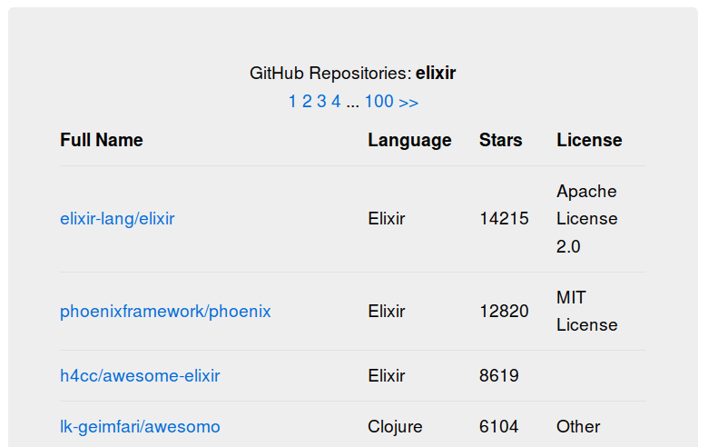

# Omitestee

## Installation

To check the implementation of the [assignment](ASSIGNMENT.md):

  * Install dependencies with `mix deps.get`
  * Install Node.js dependencies with `cd assets && npm install`
  * Start Phoenix endpoint with `mix phx.server`

Now you can use [`localhost:4000`](http://localhost:4000).

## Usage

Available routes:

HTTP method | Route         | Description
----------- | ------------- | -----------------------------------------------------------------------
POST        | /api/document | Transforms document from one format to another
GET         | /search       | Shows GitHub repositories that match the query `elixir` with pagination

## Examples

### Part 1

##### Request

```
curl -X POST -H "Content-Type: application/json" -d '{"0":[{"id":10,"title":"House","level":0,"dfsfsd":666,"children":[],"parent_id":null}],"1":[{"id":12,"title":"Red Roof","level":1,"children":[],"parent_id":10},{"id":18,"title":"Blue Roof","level":1,"children":[],"parent_id":10},{"id":13,"title":"Wall","level":1,"children":[],"parent_id":10}],"2":[{"id":17,"title":"Blue Window","level":2,"children":[],"parent_id":12},{"id":16,"title":"Door","level":2,"children":[],"parent_id":13},{"id":15,"title":"Red Window","level":2,"children":[],"parent_id":12}]}' 'http://127.0.0.1:4000/api/document'

```

##### Response

```
200 OK
[{"title":"House","parent_id":null,"level":0,"id":10,"children":[{"title":"Wall","parent_id":10,"level":1,"id":13,"children":[{"title":"Door","parent_id":13,"level":2,"id":16,"children":[]}]},{"title":"Blue Roof","parent_id":10,"level":1,"id":18,"children":[]},{"title":"Red Roof","parent_id":10,"level":1,"id":12,"children":[{"title":"Red Window","parent_id":12,"level":2,"id":15,"children":[]},{"title":"Blue Window","parent_id":12,"level":2,"id":17,"children":[]}]}]}]
```

### Part 2

Open `http://localhost:4000/search` in your browser and you can see the search result with pagination like this:


